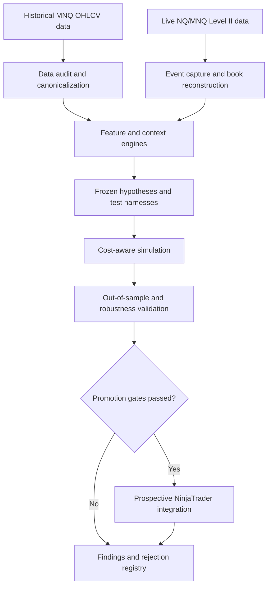

# NGUQT

## Reproducible Quantitative Research, Market Data, and Execution Platform

NGUQT is an end-to-end Python and C# platform for turning trading ideas into **causal,
falsifiable, testable software experiments** on NQ/MNQ index futures. It covers the full
research lifecycle: auditing and canonicalizing market data, building multi-timeframe
feature and context engines, freezing hypotheses before results are inspected, simulating
them under explicit cost and latency assumptions, validating them out-of-sample, and
recording every outcome — including failures — in a permanent registry. A purpose-built
NinjaTrader 8 recorder captures live Level II market depth, time-and-sales and BBO data.
The platform's defining property is not any single strategy; it is the **discipline that
makes each result trustworthy**, including the many that came back negative.

---

## Important research status

**This repository contains research infrastructure, not a validated or profitable trading
system.** Of 99 registered hypotheses, **67 are recorded as `DEAD_FROZEN`** (tested and
rejected), 13 as descriptive-only, 14 reserved and untouched, 2 as insufficient-data, and
3 as passing historical-exploratory screens only — none is promoted to live trading. The
order-flow research program is currently classified `INSUFFICIENT_DATA`. **No strategy in
this repository is approved for unattended live deployment**, and nothing here should be
read as evidence of profitability.

---

## System scale at a glance

Recalculated from Git-tracked files at the current commit:

| Dimension | Measured |
|---|---|
| Tracked files | **783** |
| Python / C# / Markdown files | 203 / 49 / 179 |
| Python / C# lines | 55,344 / 27,877 (**83,221** combined) |
| Analysis module directories | **38** |
| Dedicated test files | **27** (19 Python suites, 8 C# suites) |
| Findings reports | **51** |
| Protocol, preregistration and freeze documents | **50** |
| Data and provenance audits | 17 |
| Registered hypotheses / distinct mechanism classes | **99 / 30** |
| Canonical 1-minute records | **2,503,622** |
| Exchange trading days covered | **2,218** (2019-07-04 → 2026-08-17 ET) |

The canonical dataset's complete audit is documented in
[`analysis/mgsd/MGSD_V1_DATA_AUDIT.md`](analysis/mgsd/MGSD_V1_DATA_AUDIT.md). Related
ES/NQ and IFVG reports —
[`docs/ES_NQ_DATA_V1_AUDIT.md`](docs/ES_NQ_DATA_V1_AUDIT.md) and
[`docs/MEMORY_MATH_IFVG_V1_FINDINGS.md`](docs/MEMORY_MATH_IFVG_V1_FINDINGS.md) —
independently cross-check portions of the same canonical source.

The MGSD audit specifically records **0 duplicates, 0 OHLC violations and 0 non-positive
prices**, alongside 6,059 zero-volume bars retained and flagged rather than silently
dropped, and 1,241,630 missing minutes attributed to weekends, holidays, maintenance and
halts.

---

## Architecture



---

## What the platform does

**Data auditing and canonicalization.** Raw vendor exports are never trusted. Loaders
verify timestamp monotonicity, duplicate keys, OHLC consistency, session boundaries,
contract-roll windows and volume sanity before any feature is computed; conflicting
duplicates fail closed rather than merging silently.

**Feature and context engines.** Causal multi-timeframe aggregation, key-level hierarchies,
pivots, VWAP state, supply/demand zone context, volatility and volume regime
classification, and order-flow features including order-flow imbalance, book imbalance,
replenishment and depletion ratios, sweep detection and flow persistence.

**Frozen hypotheses.** Under the current governed research workflow, promotional
specifications — features, thresholds, entries, exits, costs, exclusions — are frozen
before outcomes are inspected. Thresholds must come from distributional rules or mechanism
logic; exploratory parameter scans cannot qualify a strategy on their own.

**Cost-aware simulation.** Fills are modeled against the first executable book snapshot
after a modeled latency, with partial fills, cancellation of the remainder, spread,
commissions and slippage. Latency is stress-tested, not assumed.

**Validation.** Day-block bootstrap and permutation testing (44 and 35 modules
respectively), negative controls, confidence intervals, out-of-sample and holdout
partitions, and multiple-comparison corrections across 12 modules.

**Registries.** A cumulative spent-hypothesis registry with mechanism fingerprinting and a
similarity screen blocking re-tests of a dead idea under a new name.

**Live capture.** A NinjaTrader 8 recorder writes Level II depth, time-and-sales and BBO
into hashed, per-run manifested files. It implements session and contract rotation,
disconnect/reconnect handling and restart-safe auditing. These paths are covered by
deterministic harnesses; live session rotation has been observed, while the current 1.2.1
build still awaits final NinjaTrader verification.

---

## Research and engineering standards

- **Negative results are kept.** Without the 67 dead hypotheses the multiplicity burden
  cannot be honestly accounted for.
- **Causality enforcement.** Features must be computable at decision time; snapshot
  helpers raise on lookahead rather than warning.
- **Fail closed.** Ambiguous data quarantines a batch instead of being repaired in place.
- **Explicit epistemic status.** Documents state what was verified, what was inferred, and
  what was not run.
- **Corrections of record.** A disproven claim is amended into its freeze document rather
  than quietly edited.

---

## Representative evidence — Start Here

| Read this | Why it matters |
|---|---|
| [`analysis/mofad/MOFAD_V1_SPENT_HYPOTHESIS_REGISTRY.csv`](analysis/mofad/MOFAD_V1_SPENT_HYPOTHESIS_REGISTRY.csv) | 99 hypotheses, dispositions, binding failure reasons |
| [`analysis/mgsd/MGSD_V1_DATA_AUDIT.md`](analysis/mgsd/MGSD_V1_DATA_AUDIT.md) | Dataset audit that disproved a claim in its own task statement |
| [`docs/ES_NQ_DATA_V1_AUDIT.md`](docs/ES_NQ_DATA_V1_AUDIT.md) | A `NOT READY` verdict blocking a program on insufficient coverage |
| [`analysis/rvmr/RVMR_5Y_OUTPUT.txt`](analysis/rvmr/RVMR_5Y_OUTPUT.txt) | 11-test, 5-year regime battery, year-by-year monotonicity |
| [`analysis/mrofyt/MLES_CAPTURE_V12_FREEZE.md`](analysis/mrofyt/MLES_CAPTURE_V12_FREEZE.md) | Recorder freeze including a failed compile and its correction |
| [`analysis/rnvp/RNVP_V1_FINDINGS.md`](analysis/rnvp/RNVP_V1_FINDINGS.md) | A rejection: positive point estimates that failed significance |
| [`analysis/mofad/MOFAD_V1_PROTOCOL_FREEZE.md`](analysis/mofad/MOFAD_V1_PROTOCOL_FREEZE.md) | Full preregistration structure |
| [`analysis/mrofyt/OPERATING_RUNBOOK.md`](analysis/mrofyt/OPERATING_RUNBOOK.md) | Operational capture procedure |
| [`docs/COMPLIANCE_AUDIT_V6.md`](docs/COMPLIANCE_AUDIT_V6.md) | Rule-by-rule audit listing open issues |

---

## Repository structure

```
analysis/   38 research modules — features, protocols, findings, registries, tests
docs/       99 protocol, preregistration, findings, audit and runbook documents
src/        34 C# files — NT8 strategies, research hosts, capture recorders
tests/      C# deterministic suites, NT8 API stubs, parity drivers
```

---

## Technology and engineering capabilities

**Python 3:** NumPy- and Pandas-based quantitative research modules, alongside
standard-library streaming pipelines for memory-bounded ingestion, auditing, hashing and
statistical validation. The Level II audit and ingestion path uses heap-merged streaming
and bounded-memory processing for multi-gigabyte event files.

**C# / .NET (NinjaTrader 8):** strategy and indicator hosts, a permanent-worker capture
architecture with atomic sequence assignment under a single lock, atomic file finalization
with per-run hashed manifests, and Mono-compatible engine cores testable without
NinjaTrader.

**Engineering practices:** deterministic tests over synthetic fixtures, adversarial tests
that falsify manifests to prove auditors catch tampering, lifecycle harnesses exercising
real concurrency and rotation, hash-pinned lineage across freezes, and import-graph proofs
that one wired entrypoint is the only executable path.

---

## Running selected tests

Dependencies vary by module: many research modules require NumPy (MGSD among them) and
some require Pandas, while the Level II capture, audit and ingestion path runs on the
standard library alone.

```bash
cd analysis/mrofyt && python3 tests_mrofyt.py          # 59 assertions
cd analysis/mrof   && python3 tests_mrof.py            # 42 assertions
cd analysis/mofad  && python3 tests_closure.py         # registry closure
cd analysis/mgsd   && python3 tests_mgsd.py            # 19 assertions (requires NumPy)
```

A full Python-suite run currently reports 549 passing checks and one registry-snapshot
mismatch. The mismatch compares an immutable 78-row historical ontology snapshot with the
current 99-row registry; the check correctly reports the difference and exits nonzero.

C# engine suites run under Mono or .NET, no NinjaTrader required:

```bash
cd tests && mcs -out:run_tests.exe \
  ../src/MnqTwoStrategiesShared.cs ../src/FakeBreakoutEngine.cs \
  ../src/VectorBreakRetestEngine.cs MockHost.cs Tests.cs && mono run_tests.exe
```

A separate syntax and binding check against NT8 API stubs is documented in
[`tests/README_NTSTUBS.md`](tests/README_NTSTUBS.md); a clean compile there verifies member
names and overload shapes only, and is **not** evidence of runtime correctness.

**NinjaTrader installation.** Installation differs by component. For the automated
strategy, copy `src/MnqTwoStrategies.cs`, `src/MnqTwoStrategiesShared.cs`,
`src/FakeBreakoutEngine.cs`, and `src/VectorBreakRetestEngine.cs` into
`Documents\NinjaTrader 8\bin\Custom\Strategies\`. For Level II capture, create a
NinjaScript Indicator or place `src/MlesV12CaptureHost.cs` in
`Documents\NinjaTrader 8\bin\Custom\Indicators\`. Compile with **F5**. The automated
strategy must be applied to an MNQ chart and refuses non-MNQ instruments. Read
[`docs/COMPLIANCE_AUDIT_V6.md`](docs/COMPLIANCE_AUDIT_V6.md) and
[`docs/CHANGELOG_V6.md`](docs/CHANGELOG_V6.md) before interpreting a backtest;
[`analysis/mrofyt/OPERATING_RUNBOOK.md`](analysis/mrofyt/OPERATING_RUNBOOK.md) covers
capture installation and operation.

---

## Current status and limitations

- **No validated edge exists.** The great majority of tested hypotheses were rejected.
- The historical dataset is **OHLCV only** — no historical bid/ask, trade prints or depth.
  Depth data cannot be reconstructed retrospectively; it exists only from the moment
  capture begins.
- Order-flow research is at `INSUFFICIENT_DATA` pending a minimum number of recorded
  sessions; the outcome stage is gated behind an authorization file that does not exist,
  and the ingest runner raises rather than computing outcomes.
- Three candidates are frozen awaiting prospective validation; none is promoted.
- Recorder build 1.2 completed a genuine NinjaTrader F5 compile and live capture. The
  current 1.2.1 repair remains pending a user-side F5 compile, reinstall and first 1.2.1
  session audit. Mono stub compiles prove syntax only.
- A genuine MNQ run recorded a 259 ms median receive-minus-exchange timestamp difference.
  Clock-synchronization confounding remains unresolved, so this is recorded but not
  interpreted as pure feed or network latency — see
  [`analysis/mrofyt/MLES_CAPTURE_V12_FREEZE.md`](analysis/mrofyt/MLES_CAPTURE_V12_FREEZE.md).

---

## My role and use of AI assistance

I defined the research questions, trading constraints, acceptance gates, validation
standards and deployment requirements; directed iterative AI-assisted implementation;
reviewed results; maintained the experiment and exposure registries; and managed the
NinjaTrader data-capture and verification workflow.

AI coding assistants were used extensively for implementation, code review and
documentation throughout.

**To be unambiguous:** NGUQT demonstrates **AI-assisted software engineering**. It does
**not** contain, implement or depend on an LLM, RAG pipeline or agent framework at runtime.
No model is invoked by any code in this repository. Every runtime component is
deterministic Python or C#.

---

## Research and risk disclaimer

This repository is research infrastructure published for engineering and methodological
review. It is **not** investment advice and **not** an offer of any financial product.

The Level II capture components are read-only and contain no order-submission APIs.
Separate NinjaTrader strategy code contains order-entry methods, but it is not presented as
validated or approved for live use.

Futures trading carries substantial risk of loss. Historical or simulated results —
particularly the rejected hypotheses documented here — do not indicate future performance.
